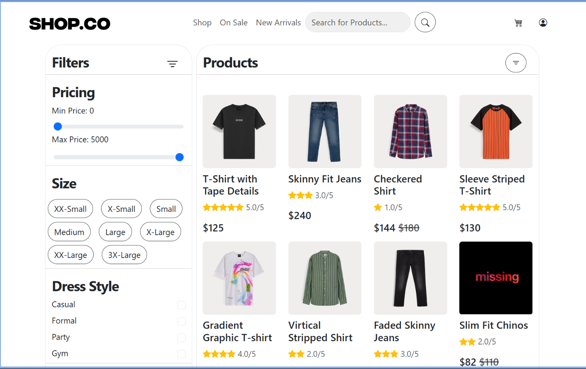
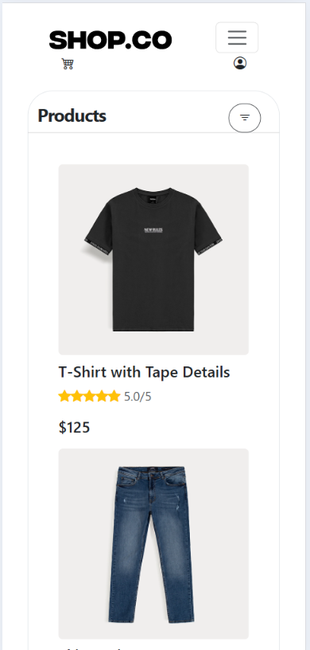
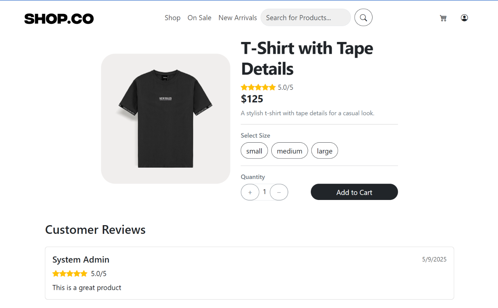
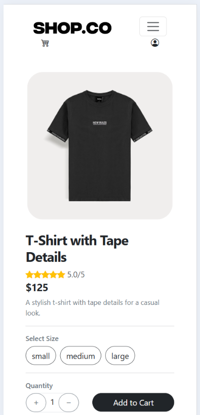
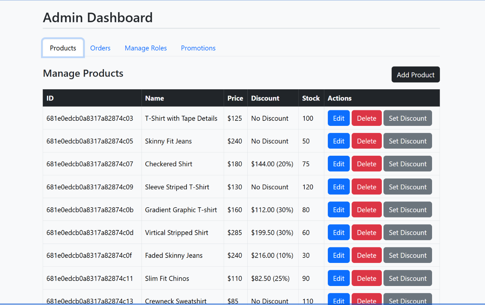
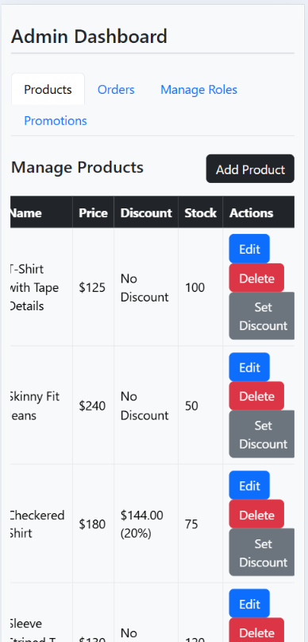

# 🛍️ SHOP.CO — E-Commerce Clothing Website

[](https://nodejs.org/)  
[](https://www.mongodb.com/)  
[](https://expressjs.com/)  
[](#-license)  

**SHOP.CO** is an **E-Commerce web application** for clothing shopping, built as part of the *Internet Programming* course at our university.  
This project demonstrates a full-stack implementation with **Node.js, Express, MongoDB, and a custom frontend**.

---

## 📑 Table of Contents

- [✨ Features](#-features)  
- [🛠 Tech Stack](#-tech-stack)  
- [🚀 Getting Started](#-getting-started)  
  - [Prerequisites](#prerequisites)  
  - [Installation](#installation)  
- [▶️ Usage](#️-usage)  
- [📸 Screenshots](#-screenshots)  
- [📂 Project Structure](#-project-structure)  
- [🤝 Contributing](#-contributing)  
- [📜 License](#-license)  

---

## ✨ Features

- 👤 **User Authentication & Authorization** (Sign up, login, protected routes)
- 🛒 **Shopping Cart** functionality
- 📦 **Product Management** (listings, categories, details)
- 💳 **Order Handling & Checkout**
- ⚡ RESTful **API routes** with controllers & middleware
- 🎨 **Frontend** with HTML/CSS/JS integrated with backend APIs
- 🔐 Secure handling of environment variables via `.env`

---

## 🛠 Tech Stack

- **Backend**: Node.js, Express.js  
- **Database**: MongoDB (Mongoose for schema modeling)  
- **Frontend**: HTML, CSS, JavaScript (custom, served via `frontend/`)  
- **Other Tools**: dotenv, bcrypt (for password hashing), JWT (for authentication)  

---

## 🚀 Getting Started

### Prerequisites
- [Node.js](https://nodejs.org/) (v16 or higher recommended)  
- [MongoDB](https://www.mongodb.com/try/download/community) (local or cloud instance like Atlas) 
- [MongoDB Command Line Database Tools](https://www.mongodb.com/try/download/database-tools) (**Optional** for Mock Database Setup)

### Installation

1. Clone the repository:
   
   ```bash
   git clone https://github.com/youssefmohammed03/IP-Project.git
   cd IP-Project
   ```

2. Install dependencies:

   ```bash
   npm install
   ```

3. (Optional) Create/Replace a `.env` file in the root directory and configure it:

   ```env
   PORT=3000
   MONGO_URI=your_mongodb_connection_string
   JWT_SECRET=your_secret_key
   ```

4. (Optional) Setup Mock Database
   A pre-populated MongoDB database dump is provided under `./mock_db/`.
   You can restore it into your local MongoDB instance with:

   ```bash
   mongorestore --db ecommerce ./mock_db/ecommerce
   ```

   * This will create an `ecommerce` database with all collections (products, users, orders, etc.).
   * Ensure MongoDB is running before restoring.

5. Start the development server:

   ```bash
   npm start
   ```

   or

   ```bash
   node server.js
   ```

---

## ▶️ Usage

* Visit: `http://localhost:3000/`
* Explore product listings, register/login as a user, add items to cart, and simulate checkout.
* Admin routes allow managing product inventory.

---

## 📸 Screenshots

Here is a showcase of selected pages from **SHOP.CO** (desktop and mobile). While these images highlight core functionality, the site offers more features and pages that can be explored by running the project.

### 🏠 Home
<details>
  <summary>View Home Screens</summary>
  <table>
    <tr>
      <td></td>
      <td></td>
    </tr>
  </table>
</details>

---

### 🛍 Products
<details>
  <summary>View Products Screens</summary>
  <table>
    <tr>
      <td></td>
      <td></td>
    </tr>
  </table>
</details>

---

### 👕 Product Detail
<details>
  <summary>View Product Detail Screens</summary>
  <table>
    <tr>
      <td></td>
      <td></td>
    </tr>
  </table>
</details>

---

### ⚙️ Admin Dashboard
<details>
  <summary>View Admin Dashboard Screens</summary>
  <table>
    <tr>
      <td></td>
      <td></td>
    </tr>
  </table>
</details>

---

## 📂 Project Structure

```
IP-Project/
│── config/         # Database and server configurations
│── controllers/    # Business logic for routes
│── docs/           # Project documentation
│── frontend/       # HTML/CSS/JS frontend
│── middleware/     # Authentication & error-handling middleware
│── models/         # Mongoose data models
│── routes/         # Express route definitions
│── utils/          # Utility functions
│── server.js       # Main server entry point
│── package.json    # Dependencies & scripts
```

---

## 📜 License

This project is for **educational purposes** and is not licensed for commercial use.
You are free to explore, learn, and adapt the code.

---
